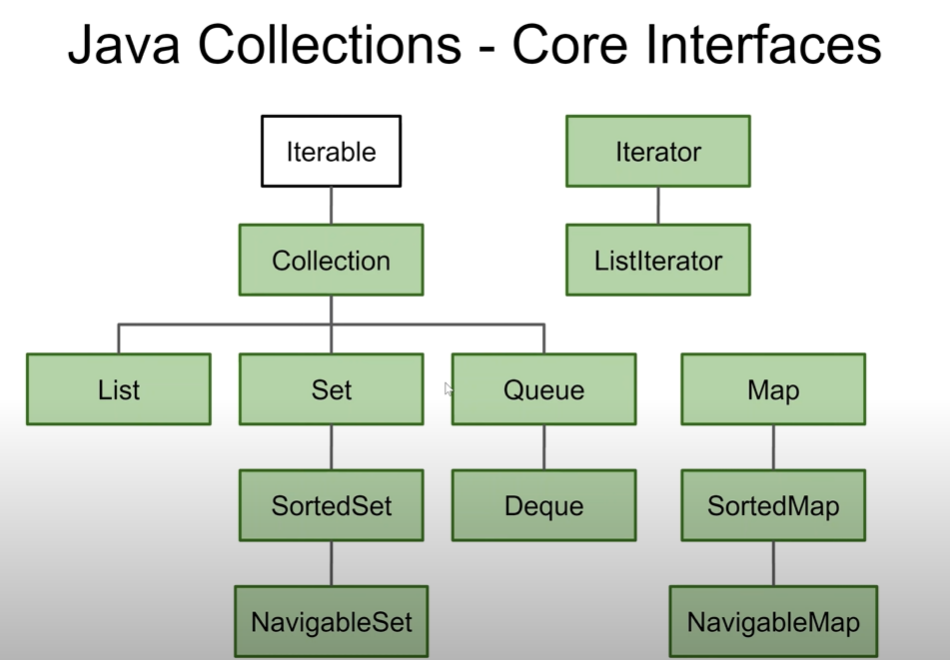

# Java Collections

The Java Collection interface represents the operations possible on a generic collection, like on a List, Set, Stack, Queue
and Deque. For instance, methods to access the elements based on their index are available in the Java Collection interface.

## Java List

The Java List interface represents an ordered collection of objects. By ordered means, that you can access the elements in the order they occur in the list.

## Java Set

The Java Set interface represents an unordered collection of objects. Unlike the List, a Set does not allow you to access the elements
of a Set in any guaranteed order. There are Set implementations that order elements based on their natual ordering, but the Set interface itself provides no such guarantees.

## Java SortedSet

The Java SortedSet interface represents an ordered collection of objects. Thus, the elements in the SortedSet can be iterated in the sorted order.

## Java NavigableSet

The Java NavigableSet interface is an extension of the SortedSet interface with additional methods for eay navigation of the elements in the NavigableSet.

## Java Map

The Java Map interface represents a mapping between sets of keys and values. Both keys and values are objects. You insert a key + value pair into a Map, and later you can retrieve the value via the key
meaning you only need the key to read the value out of the Map again later.

## Java SortedMap

The Java SortedMap interface is an extension of the Map interface, representing a Map where the keys in the Map are sorted.
Thus, you can iterate the keys stored in the SortedMap in the sorted order, rather than the kind-of-random order you can iterate them in a normal Map.

## Java NavigableMap

The Java NavigableMap interface is an extension of the SortedMap interface which contains additional methods for easy navigation of the keys and entries in the NavigableMap

## Java Stack

The Java Stack class represents a classical stack data structure, where elements can be pushed to the top of the stack, and popped off from the top of the stack again later.

## Java Queue

The Java Queue interface represents a classical queue data structure, where objects are inserted into one end of the queue, and taken off the queue in other end of the queue. This is opposite of how you use a stack.

## Java Deque

The Java Deque interface represents a double ended queue, meaning a data structure where you can insert and remove elements from both ends of the queue.

## Java Iterator

The Java Iterator interface represents a component that is capable of iterating a Java Collection of some kind. For instance, a List or a Set.

## Java Iterable

The Java Iterable interface is very similar in responsibility to the Java Iterator interface. The Iterable interface allows a Java Collection to be iterated using the for-each loop in Java.